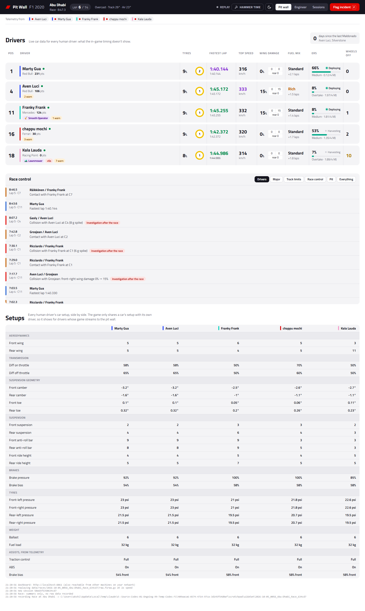
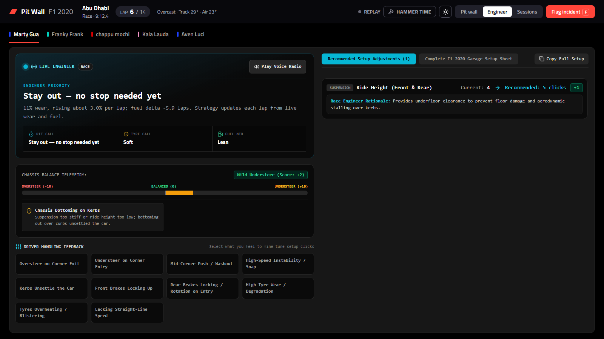
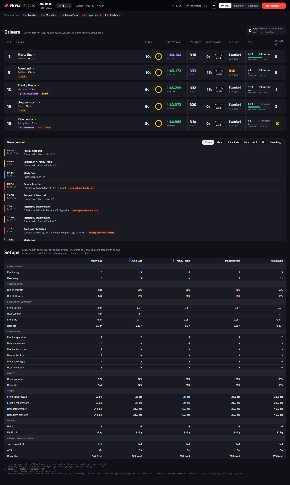
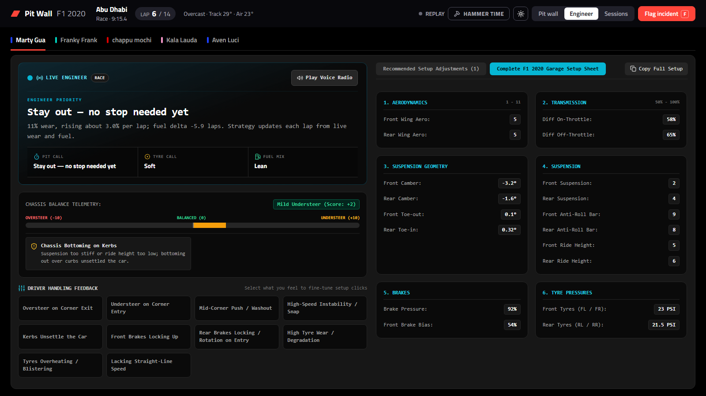
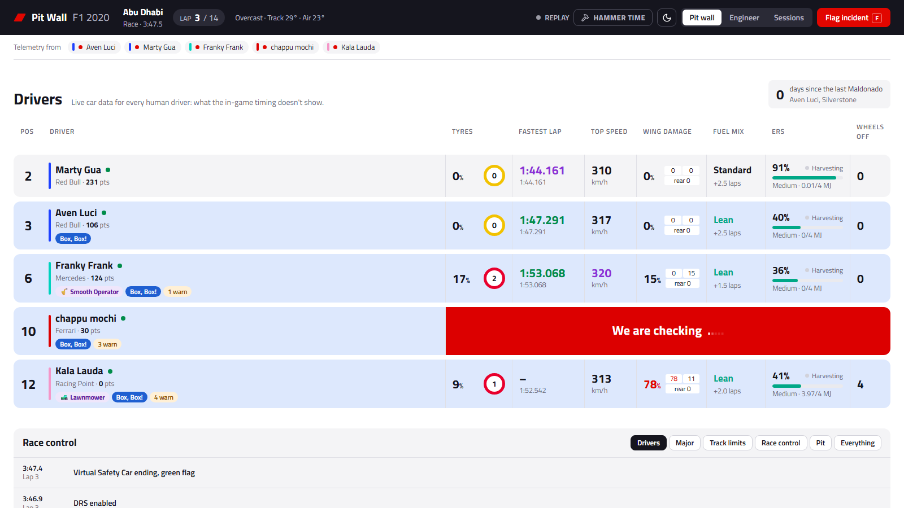
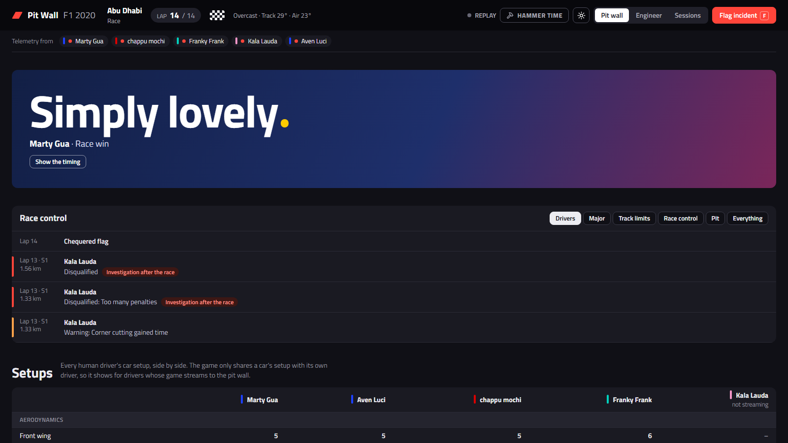

# F1 2020 Pit Wall

A live pit wall for F1 2020 online lobbies. Every driver's game sends its telemetry to one computer, and
everyone opens the dashboard in a browser:

- **Pit wall**: each human driver's tyres and wear, lap times, top speed, wing damage, fuel, ERS and track
  limits, live race control with incidents, everyone's setups side by side, and season points.
- **Engineer**: setup advice for one driver from their own car's telemetry and how the car feels to
  them, on one screen. Built on Vinamra's F1 2020 AI Race Engineer.
- **Sessions**: a summary of every practice, qualifying and race, and the raw recording of the last race.

Plus a few lobby jokes. **Hammer Time** turns them off when things get serious.





| | |
|---|---|
|  |  |
|  |  |

## How to use it

1. **On the hosting computer** (Python 3.11 or newer, nothing to install):

   ```
   python -m f1live
   ```

   Open `http://localhost:8020`. Everyone else opens `http://<host's IP>:8020`; the Tailscale IP works.

2. **Every driver, in F1 2020**: Game Options → Settings → Telemetry Settings:
   UDP Telemetry **On**, UDP IP Address **the host's IP**, Port **20777**, Send Rate **20 Hz**,
   Format **2020**, Your Telemetry **Public**.

3. **Practice**: open the **Engineer** tab and pick your name. Tick what the car feels like, apply the
   suggested changes, and use **Copy Full Setup** for the garage.

4. **Qualifying and race**: watch the **Pit wall**. Press **F** (or *Flag incident*) to mark a moment
   for the race report.

5. **Afterwards**: the **Sessions** tab has every summary. A race's raw recording is kept until the next
   race starts; press **Keep** to hold on to it.

Settings such as ports and the data folder go in `f1live.toml` (start from `f1live.example.toml`).
`python -m f1live replay data/races/<session>/raw.f1raw.gz` replays a recorded race.
Earlier UI versions are kept in [`UI/`](UI).
